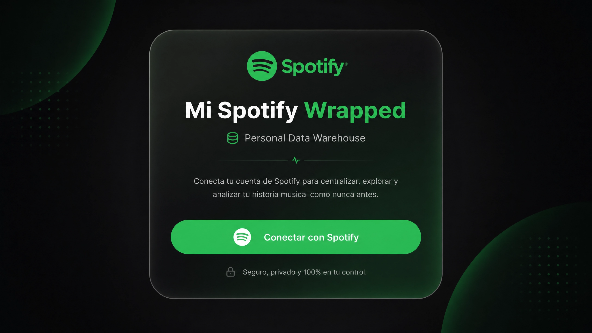
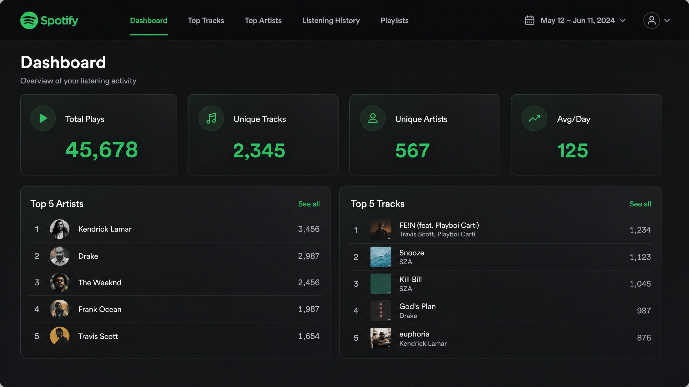
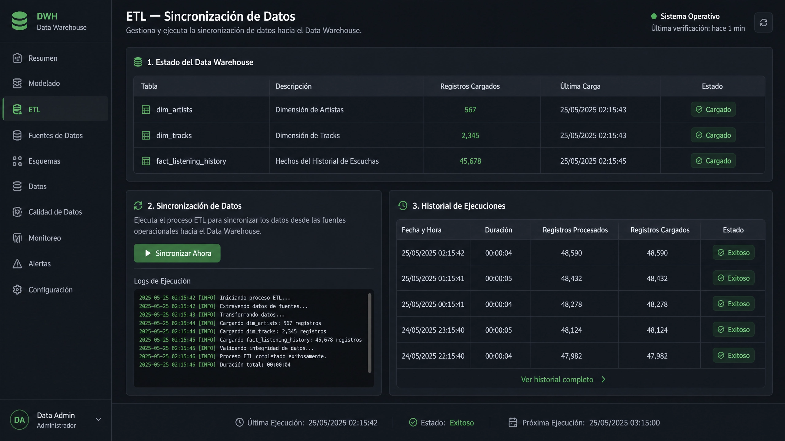
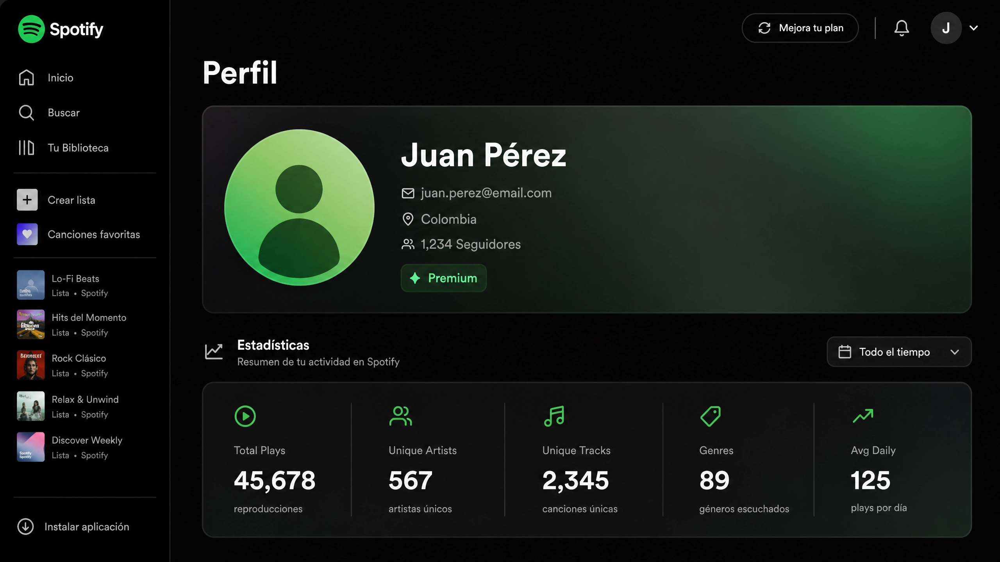

# 03 — Implementación del Frontend (Diseño Asistido por IA)

**Universidad de Pamplona · Bases de Datos II · 2026-I**  
**Integrantes:** Suley Suárez · Jhonatan Vera

---

## Herramienta de IA Utilizada

| Campo | Detalle |
|---|---|
| **Herramienta** | Manus AI |
| **Fase** | Diseño de vistas + generación de código base del frontend |
| **Técnica de prompting** | Prompting descriptivo con contexto estructurado (zero-shot con especificaciones técnicas completas) |
| **Fecha de uso** | Mayo 2026 |

---

## Prompt Utilizado para el Diseño de Vistas

El siguiente prompt fue enviado a Manus para generar el plan de diseño completo del frontend:

```
Actúa como un diseñador UI/UX senior y desarrollador frontend especializado en React, 
TypeScript y Tailwind CSS.

Necesito que diseñes todas las vistas de una aplicación web llamada "Mi Spotify Wrapped" — 
un Personal Data Warehouse que consume la Spotify Web API.

STACK TECNOLÓGICO:
- React 19 + TypeScript
- Vite como bundler
- Tailwind CSS para estilos
- Framer Motion para animaciones
- Recharts para gráficos
- lucide-react para iconos
- Wouter para routing

FILOSOFÍA DE DISEÑO:
- Glassmorphism Premium Dark
- Fondo: #121212 (Spotify dark)
- Acento primario: #1DB954 (Spotify green)
- Cards: rgba(255, 255, 255, 0.05) con backdrop-filter: blur(10px)
- Texto: #E0E0E0
- Tipografía: Nunito (headings) + Inter (body)
- Animaciones con Framer Motion: entrada scale(0.95)→scale(1), hover brightness(1.1)

PÁGINAS A DISEÑAR:
1. /login — Autenticación con Spotify (botón OAuth PKCE, NO formulario)
2. /callback — Silenciosa, solo guarda JWT y redirige
3. /dashboard — Panel principal con 4 widgets analíticos
4. /profile — Perfil del usuario con estadísticas personales
5. /etl — Panel de control del pipeline ETL con logs en vivo
6. /404 — Página de error personalizada

WIDGETS DEL DASHBOARD:
- QuickStatsCards: 4 tarjetas (Total Plays, Unique Tracks, Unique Artists, Avg/Day)
- TopArtistsCard: Top 5 artistas con foto, nombre y conteo de plays
- TopTracksCard: Top 5 canciones con portada, nombre y conteo de plays
- PeakHourCard: Gráfico de área/barras con distribución horaria (eje X: horas 0-23)
- GenresChart: Barras horizontales con top 10 géneros musicales

COMPONENTES REUTILIZABLES NECESARIOS:
- SkeletonCard: Placeholder animado (shimmer) mientras carga
- EmptyState: Mensaje cuando no hay datos + CTA
- ErrorState: Mensaje de error + botón Reintentar
- Navbar: Sticky, logo + links de navegación + Logout

PÁGINA ETL (/etl):
- Tabla de estado del DWH (dim_artists, dim_tracks, fact_listening_history con conteo)
- Botón "Sincronizar Ahora" que dispara POST /v1/etl/run
- Terminal con logs línea por línea con animación de aparición
- Tabla de historial de las últimas ejecuciones (fecha, duración, registros, estado)

NAVEGACIÓN:
- Rutas protegidas: /dashboard, /profile, /etl (requieren JWT válido)
- Rutas públicas: /login, /callback, /404
- ProtectedRoute component que redirige a /login si no hay token

Para cada página genera:
1. Wireframe ASCII de la estructura
2. Lista de componentes
3. Descripción del flujo del usuario
4. Notas de implementación
5. Especificaciones de animación

Hazlo completo, profesional y listo para implementar.
```

---

## Técnica de Prompting Aplicada

**Zero-shot con especificaciones técnicas estructuradas:**

Se proporcionó al modelo todo el contexto necesario en un único prompt sin ejemplos previos. La estructura del prompt siguió el patrón:

1. **Rol asignado** — "Actúa como diseñador UI/UX senior" para orientar el estilo de respuesta
2. **Stack tecnológico explícito** — Se listaron las librerías exactas para que el código generado fuera compatible sin adaptaciones
3. **Design system definido** — Colores, tipografía y animaciones específicos evitaron respuestas genéricas
4. **Lista exhaustiva de páginas y componentes** — Cada widget nombrado con su función para obtener wireframes coherentes entre sí
5. **Formato de salida requerido** — Se pidió wireframe ASCII + componentes + flujo + notas de implementación por página

Esta técnica es efectiva cuando el contexto del problema está bien definido y se quiere una respuesta completa en una sola iteración.

---

## Diseño Generado por Manus

### 1. Login (`/login`)

```
┌─────────────────────────────────────────┐
│                                         │
│         [Spotify Logo]                  │
│                                         │
│   Mi Spotify Wrapped                    │
│   Personal Data Warehouse               │
│                                         │
│   Conecta tu cuenta de Spotify para     │
│   explorar tu historial musical y       │
│   analíticas personales.                │
│                                         │
│   ┌─────────────────────────────────┐   │
│   │  Conectar con Spotify           │   │
│   └─────────────────────────────────┘   │
│                                         │
└─────────────────────────────────────────┘
```

**Componentes:** Hero card glassmorphism centrada · Logo Spotify (#1DB954) · Botón con hover effect · Descripción de permisos

---

### 2. Dashboard (`/dashboard`)

```
┌──────────────────────────────────────────────────────────────┐
│  [Logo] Mi Spotify Wrapped    [Profile] [Logout]             │
├──────────────────────────────────────────────────────────────┤
│  ┌─────────────┬─────────────┬─────────────┬─────────────┐   │
│  │ Total Plays │ Unique Trks │ Unique Arts │ Avg/Day     │   │
│  │    1,234    │     567     │     123     │     45      │   │
│  └─────────────┴─────────────┴─────────────┴─────────────┘   │
│  ┌────────────────────────┐  ┌────────────────────────┐      │
│  │   Top 5 Artistas       │  │   Top 5 Canciones      │      │
│  │ 1. Artist Name (234)   │  │ 1. Song Name (45)      │      │
│  │ 2. Artist Name (189)   │  │ 2. Song Name (38)      │      │
│  └────────────────────────┘  └────────────────────────┘      │
│  ┌────────────────────────┐  ┌────────────────────────┐      │
│  │   Hora Pico [Chart]    │  │   Géneros Top [Chart]  │      │
│  └────────────────────────┘  └────────────────────────┘      │
└──────────────────────────────────────────────────────────────┘
```

**Componentes:** `QuickStatsCards` · `TopArtistsCard` · `TopTracksCard` · `PeakHourCard` (Recharts AreaChart) · `GenresChart` (barras horizontales)

---

### 3. Profile (`/profile`)

```
┌──────────────────────────────────────────────────────────────┐
│  ┌──────────┐  Nombre Usuario · Premium Badge               │
│  │  Avatar  │  email@example.com                             │
│  └──────────┘  País: Colombia · Seguidores: 1,234           │
│  ┌────────────────────────────────────────────────────────┐  │
│  │  Estadísticas: Total Plays · Artistas · Canciones       │  │
│  └────────────────────────────────────────────────────────┘  │
└──────────────────────────────────────────────────────────────┘
```

---

### 4. ETL (`/etl`)

```
┌──────────────────────────────────────────────────────────────┐
│  Estado del DWH                                              │
│  dim_artists: 266 registros  ✓                               │
│  dim_tracks: 596 registros   ✓                               │
│  fact_listening_history: 628 ✓                               │
├──────────────────────────────────────────────────────────────┤
│  [Sincronizar Ahora]                                         │
│  ┌──────────────────────────────────────────────────────┐   │
│  │ $ Extrayendo datos de Spotify...                     │   │
│  │ $ Artistas extraídos: 50                              │   │
│  │ $ ETL completado en 2.3s ✓                            │   │
│  └──────────────────────────────────────────────────────┘   │
├──────────────────────────────────────────────────────────────┤
│  Historial: Fecha | Duración | Registros | Estado           │
└──────────────────────────────────────────────────────────────┘
```

---

## Implementación Final — Screenshots

Las siguientes capturas muestran la implementación real del frontend comparada con los wireframes del diseño:

### Login


### Dashboard


### ETL Panel


### Perfil


---

## Decisiones de Diseño Tomadas Durante la Implementación

| Elemento | Diseño Manus | Implementación Final | Razón del Cambio |
|---|---|---|---|
| Tipografía | Nunito + Inter | DM Sans | DM Sans es más cercana a Spotify Circular (fuente oficial de Spotify) y está disponible en Google Fonts |
| PeakHourCard | Bar chart horizontal | Area chart con gradiente | El área chart comunica mejor la distribución horaria continua |
| Selector de período | No definido en wireframe | Botones Día/Semana/Mes/Todo | Agregado para enriquecer la analítica temporal |
| TopArtistsCard | Lista simple | Cards con imágenes y género | Se aprovechan los datos de imagen y géneros disponibles en el DWH |
| Navbar | Top horizontal | Lateral (sidebar) | Mejor uso del espacio vertical en pantallas de laptop |

---

## Paleta de Colores Implementada

| Uso | Color | Hex |
|---|---|---|
| Fondo principal | Dark Spotify | `#121212` |
| Cards | Glassmorphism | `rgba(255,255,255,0.05)` |
| Acento primario | Spotify Green | `#1DB954` |
| Texto principal | Light Gray | `#E0E0E0` |
| Texto secundario | Gray | `rgba(255,255,255,0.4)` |
| Bordes | Subtle White | `rgba(255,255,255,0.1)` |

---

## Prompt de Integración Backend–Frontend (Manus)

Adicionalmente, se utilizó Manus para integrar el frontend generado con el backend FastAPI existente:

```
Tengo un frontend React + TypeScript generado previamente y un backend FastAPI 
con los siguientes endpoints bajo /v1:

- GET /auth/login → devuelve { authorization_url }
- GET /auth/callback → redirige a /callback?token=JWT
- GET /artists/top → top 10 artistas (JWT requerido)
- GET /tracks/top → top 10 canciones (JWT requerido)
- GET /history/stats → estadísticas rápidas (JWT requerido)
- GET /history/genres → top 10 géneros (JWT requerido)
- GET /history/peak-hour → hora pico (JWT requerido)
- GET /history/peak-hour/distribution → distribución 24h (JWT requerido)
- GET /profile/me → perfil del usuario (JWT requerido)
- POST /etl/run → ejecutar ETL (JWT requerido)
- GET /etl/status → estado DWH + últimas ejecuciones (JWT requerido)

El JWT se almacena en localStorage["app_token"] y se inyecta en cada request 
como Authorization: Bearer <token>.

Integra el frontend con este backend:
1. Crea lib/api.ts con un wrapper fetch que inyecte el token automáticamente
   y maneje errores 401 con redirect a /login
2. Crea lib/auth.ts con getToken(), isTokenValid() (decodifica JWT client-side
   para verificar exp), y logout()
3. Conecta cada componente del dashboard a su endpoint correspondiente
4. Asegúrate de que /callback lea el token de URLSearchParams y lo guarde
5. Implementa ProtectedRoute que use isTokenValid()

Base URL del backend: http://127.0.0.1:8000
```
